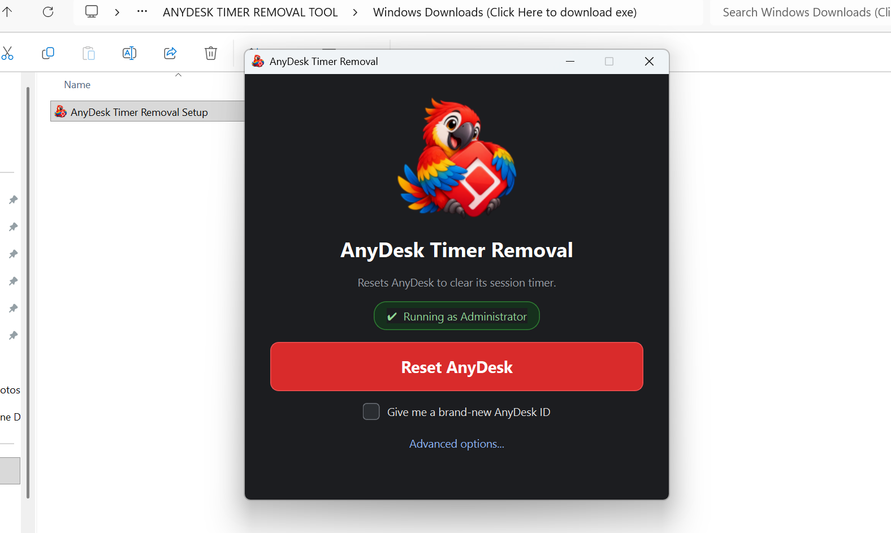
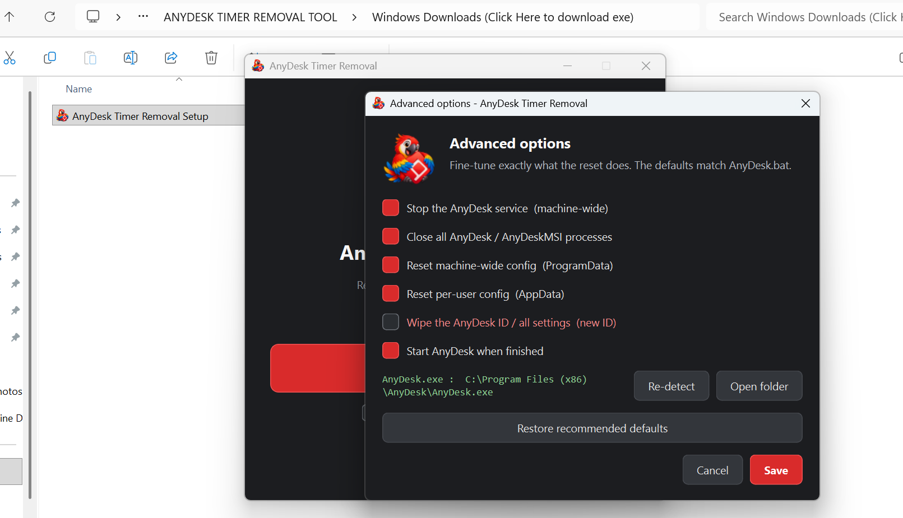
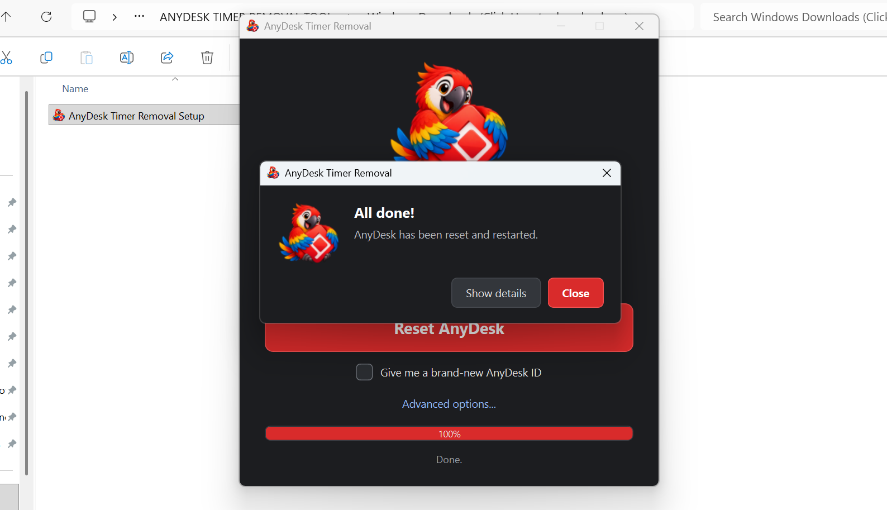

<div align="center">


# AnyDesk Timer Removal

**Clear AnyDesk's free-session timer in one click.**

[](#)
[](#)
[](#)
[](#)
[](#)

</div>

---

## Overview

**AnyDesk Timer Removal** is a small Windows desktop utility that resets
AnyDesk's configuration in order to clear its free-session timer. It performs
exactly the same steps as the well-known `AnyDesk.bat` script, but wraps them in
a simple, no-console [PyQt6](https://www.riverbankcomputing.com/software/pyqt/)
GUI that anyone can use.

It runs as Administrator automatically, shows live progress and a step-by-step
log, and never flashes a `cmd` window. Nothing is bundled or phoned home — the
tool only touches your local AnyDesk installation.

> **Who is it for?** Anyone who wants to reset AnyDesk without editing batch
> files, hunting down config paths, or remembering service names.

---

## Screenshots

| Main window | Advanced options | All done |
|:--:|:--:|:--:|
|  |  |  |
| One button, one checkbox, zero clutter. | Fine-tune every step of the reset. | Clear confirmation with an optional log. |

---

## What it does

The tool mirrors `AnyDesk.bat`, running these steps in order:

| # | Step | Details |
|:-:|------|---------|
| 1 | **Stop the AnyDesk service** | Stops the machine-wide `AnyDesk` Windows service, if it exists. |
| 2 | **Close AnyDesk processes** | Force-closes every `AnyDesk.exe` and `AnyDeskMSI.exe`, then waits for handles to be released. |
| 3 | **Delete AnyDesk config** | Removes `%ProgramData%\AnyDesk\service.conf`, `%ProgramData%\AnyDesk\system.conf` and `%AppData%\AnyDesk\system.conf` — optionally also `%AppData%\AnyDesk\user.conf`. |
| 4 | **Restart AnyDesk** | Locates `AnyDesk.exe` and launches it again. |

Clearing the configuration is what resets the session timer — hence the name.

---

## Features

- **One-click reset.** A single big button does the whole job with recommended
  defaults that match `AnyDesk.bat`.
- **Runs elevated, silently.** The app relaunches itself through `pythonw.exe`
  and UAC, so it gets Administrator rights without ever showing a console
  window. Every helper process is spawned hidden.
- **Advanced options.** Power users can pick exactly which steps run, choose the
  AnyDesk install path, and restore the recommended defaults at any time.
- **Brand-new ID.** An optional checkbox wipes the AnyDesk ID and all settings
  (off by default, because it is destructive).
- **Live progress + log.** A real progress bar and a detailed, copyable cleanup
  log so you can see precisely what happened.
- **Portable and self-contained.** The installer ships a complete `onedir`
  build — no Python installation required on the target PC.
- **Small and fast.** Unused Qt modules and plugins are stripped from the
  bundle, and UPX is disabled on purpose to avoid antivirus false positives.
- **No telemetry.** Nothing is collected, sent anywhere, or left behind.

---

## Download

Grab the ready-to-run installer:

> **[Download `AnyDesk Timer Removal Setup.exe`](<Windows Downloads (Click Here to download exe)/AnyDesk Timer Removal Setup.exe>)**

Run the setup and launch **AnyDesk Timer Removal** from the Start Menu.

- Installs **per-user by default** (no UAC needed to install); you can choose
  *install for all users* in the privileges dialog.
- When you start the app it asks for Administrator rights — that is required to
  stop the service and delete machine-wide configuration files.

---

## Run from source

**Requirements:** Windows 10/11 and Python 3.14 with PyQt6.

```powershell
pip install -r requirements.txt
pythonw "Source Codes\app.py"
```

- `pythonw` is recommended so no console window appears.
- `python "Source Codes\app.py"` also works — the app automatically relaunches
  itself console-less and elevated.

**Command-line flags**

| Flag | Purpose |
|------|---------|
| `--no-elevate` | Do not try to become Administrator (also via `ATR_NO_ELEVATE=1`). |
| `--relaunched` | Internal flag set on the elevated re-launch. |

---

## Build from source

Two small batch files drive the whole build.

```powershell
# 1. Build the executable (PyInstaller, onedir)
Source Codes\build_exe.bat
#    -> Source Codes\dist\AnyDesk Timer Removal\AnyDesk Timer Removal.exe

# 2. Wrap it into a Setup.exe (Inno Setup 6)
Source Codes\build_installer.bat
#    -> Source Codes\dist_installer\AnyDesk Timer Removal Setup.exe
```

**Build prerequisites**

| Tool | Why |
|------|-----|
| Python 3.14 | Runs the app and the build scripts. |
| PyInstaller | Freezes `app.py` into a standalone executable (`app.spec`). |
| Pillow | Optional — downscales the artwork for the bundle; the build still works without it. |
| Inno Setup 6 | Compiles `installer.iss` into the `Setup.exe`. Expected at `C:\Program Files (x86)\Inno Setup 6\ISCC.exe`. |

---

## Advanced options

Open **Advanced options** in the main window to control each step:

| Option | Default | Notes |
|--------|:-------:|-------|
| Stop the AnyDesk service (machine-wide) | ✅ | Requires Administrator. |
| Close all AnyDesk / AnyDeskMSI processes | ✅ | Forces a clean restart. |
| Reset machine-wide config (ProgramData) | ✅ | Deletes `service.conf` / `system.conf`. |
| Reset per-user config (AppData) | ✅ | Deletes the per-user `system.conf`. |
| Wipe the AnyDesk ID / all settings (new ID) | ⬜ | Destructive — also deletes `user.conf`. |
| Start AnyDesk when finished | ✅ | Relaunches AnyDesk automatically. |

You can also **Re-detect** the AnyDesk location, **Open folder** to jump to
AnyDesk's data directory, or **Restore recommended defaults**.

---

## Project structure

```
ANYDESK TIMER REMOVAL TOOL/
├─ Source Codes/
│  ├─ app.py                                # The whole GUI application
│  ├─ app.spec                              # PyInstaller build definition (size-optimised)
│  ├─ build_exe.bat                         # Builds the executable
│  ├─ build_installer.bat                   # Compiles the Inno Setup installer
│  ├─ installer.iss                         # Inno Setup script
│  ├─ version_info.txt                      # Windows file/version metadata
│  ├─ app.ico                               # Application icon
│  ├─ logo_512.png                          # Bundled (downscaled) artwork
│  └─ Cheerful Parrot Hugging Red Logo.png  # Original full-resolution artwork
├─ Screenshots/
│  ├─ MainMenu.png
│  ├─ AdvanceSettings.png
│  └─ Completed.png
├─ Windows Downloads (Click Here to download exe)/
│  └─ AnyDesk Timer Removal Setup.exe       # Ready-to-run installer
├─ requirements.txt
├─ .gitattributes                           # Keeps batch scripts as CRLF
├─ .gitignore
├─ LICENSE                                  # Mozilla Public License 2.0
└─ README.md
```

---

## Troubleshooting

| Symptom | Fix |
|---------|-----|
| "Not running as Administrator" banner | Click **Retry**, or right-click the app and choose *Run as administrator*. |
| Some steps fail | Make sure AnyDesk is closed and you are elevated; open **Show details** for the exact error. |
| Windows SmartScreen warning | The installer is unsigned. Choose *More info → Run anyway*. |
| Antivirus flags the executable | PyInstaller bundles are frequently flagged heuristically. UPX is disabled to reduce this; add an exclusion if needed. |
| AnyDesk was not found | Install AnyDesk first, then use **Re-detect** in Advanced options. |

---

## Disclaimer

This project is intended for **personal / educational use**. It is **not
affiliated with, endorsed by, or associated with AnyDesk Software GmbH**.
Resetting AnyDesk's configuration clears its session timer **and** its saved
settings; *Wipe the AnyDesk ID* additionally removes your AnyDesk ID
permanently. Use at your own risk — the authors accept no liability for any
data loss or damage. Always make sure you are allowed to reset the AnyDesk
installation you are running this on.

## License

Released under the **Mozilla Public License 2.0 (MPL-2.0)** — see the
[LICENSE](LICENSE) file for the full text.

### Third-party notices

- **PyQt6 / Qt** — the GUI is built on PyQt6, which is licensed under the
  GNU GPL v3 (or a commercial license from Riverbank Computing). Review those
  terms before redistributing the bundled application.
- **AnyDesk** is a trademark of AnyDesk Software GmbH. This project only
  operates on a locally installed AnyDesk and is not affiliated with it.


